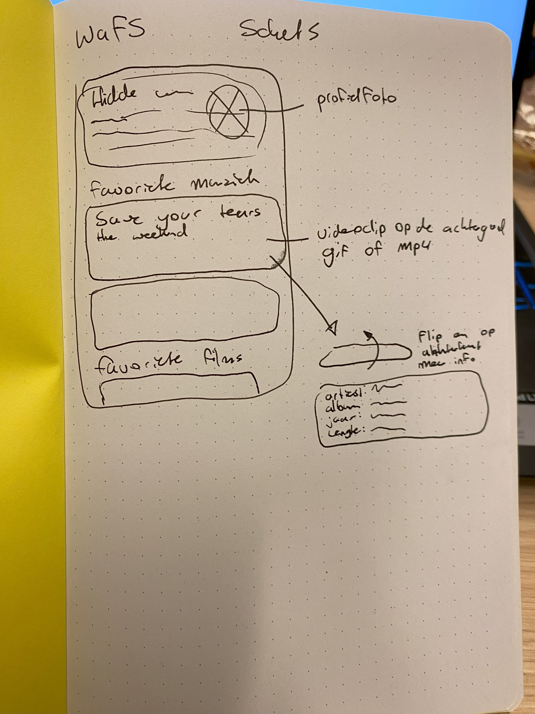
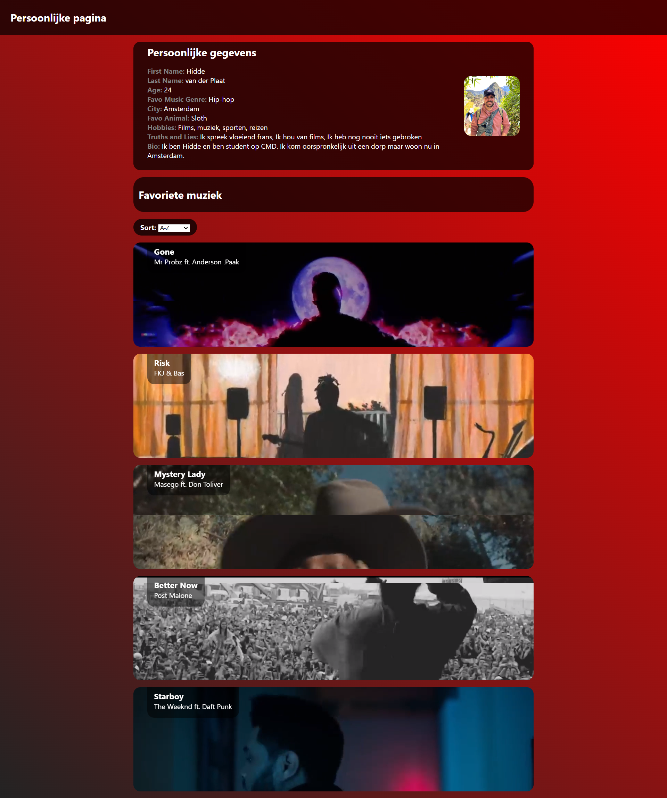
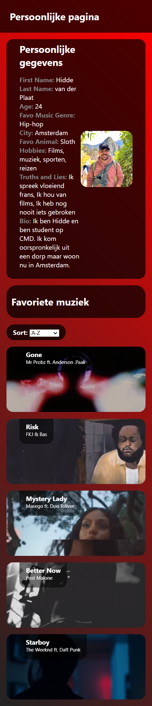

# Readme
### Dag 1
Ik wist al dat ik graag een lijst wilde maken met dingen die ik interessant of leuk vind. Met het team hadden we besloten een muzieklijst te maken met onze favoriete nummers dus daar heb ik ook mijn persoonlijke website over gemaakt om een goede doorstroom te hebben van de gegevens. Als eerste heb ik een snelle schets gemaakt voor mijn website ontwerp. Ik wilde bovenaan een blok met mijn persoonlijke info en dan per nummer een blok met daar als achtergrond iets laten gebeuren zodat je de feeling van het nummer meekrijgt. Even later bedacht ik dat dit goed de videoclip kon zijn.



Diezelfde dag heb ik hard gewerkt met Html en Css en heb ik dit gedeelte afgemaakt. Ook heb ik het meteen responsive gemaakt.




### Dag 2

Op dag 2 hebben we met het team een start gemaakt met de teamopdracht. Er is een begin gemaakt van de Repo en verder heb ik gewerkt aan de cardflip van mijn muzieknummers. Hier wilde ik aan de achterkant van het blok extra info over het nummer tonen samen met een img van de album cover. Het is gelukt dit met een :hover te doen.
Ik heb hiervoor [deze bron van codepen](https://codepen.io/edeesims/pen/wvpYWW) gebruikt.


### Dag 3 

Woensdag heb ik gewerkt aan het klikbaar maken van de cardflip. dit ging nogal lastig want er waren meer dingen die moesten gebeuren zoals het verdwijnen van de label aan de voorkant. Die wilde niet werken met   `backface-visibility: hidden;`. Uiteindelijk heb ik het maar opgelost met een `opacity: 0;` animatie. Zo is het bijna niet te zien. Hier is de complete code voor de cardflip:

```javascript
var articles = document.querySelectorAll(".card"); //haal de card class op

function flip(event) { //de functie die de juiste class toevoegd om de card te flippen
  var content = event.currentTarget.querySelector("div"); //de content bestaat uit de div van het aangeklikte element
  content.classList.toggle("content");// een toggle om class content toe te voegen aan het element
  var hgroup = event.currentTarget.querySelector("hgroup");
  hgroup.classList.toggle("opacity");// hier geef ik ook de hgroup een opacity van 0
}

articles.forEach(function (article) {//elke article krijgt een eventlistener om voor de klik
  article.addEventListener("click", flip);// dan word flip() uitgevoerd
});
```
De Css ziet er zo uit:
```css
article {
  perspective: 1000px;
  transition: 0.3s;
}

article:hover {
  transform: scale(1.05);
  z-index: 99;
  cursor: pointer;
}

article > div {
  position: relative;
  width: 100%;
  height: 100%;

  transition: transform 0.75s;
  transform-style: preserve-3d;
}

.content {
  transform: rotateX(180deg);
}

.opacity {
  opacity: 0;
  transition: 0.375s;
}

.front,
.back {
  position: absolute;
  height: 100%;
  width: 100%;
  border-radius: 1em;
}

.back {
  background-color: rgba(0, 0, 0, 0.75);
  transform: rotateX(180deg);
  backface-visibility: hidden;
  display: grid;
  grid-template: 1fr 1.5fr/2fr 1fr;
}

.back ul {
  margin: 0 2em;
}

.back h1 {
  align-self: end;
  margin: 0.5em 1.4em;
}

.back img {
  height: 10em;
  grid-area: 1/2/3/3;
  align-self: center;
  justify-self: center;
  border-radius: 1em;
}
```
### Dag 4

Ik had nog een probleem met de code die ik had gemaakt met de cardflip. Ik kon namelijk meerdere cards tegelijk flippen, maar ik wilde graag dat je maar 1 card tegelijk kan flippen. De andere card flipt dan terug.
Ik had wel een idee hoe dit gedaan kon worden maar niet hoe ik dit in js moest schrijven. Ik heb ChatGPT gevraagd: "How can I remove the class content from all not clicked articles". ChatGPT kwam hiermee:

```javascript
articles.forEach(function (article) {
    if (article !== event.currentTarget) {
      let otherContent = article.querySelector("div");
      otherContent.classList.remove("content");
      // all other flipped cards flip back on click

      let otherHgroup = article.querySelector("hgroup");
      otherHgroup.classList.remove("opacity");
    }
  });
```
Daar heb ik zelf ook de class bijgezet om de opacity van hgroup op 0 te zetten.

### Dag 5

Op dag 5 heb ik vooral gewerkt aan de teamapp.

### Dag 6

Maandag heb ik mij vooral beziggehouden met het fetchen van de data uit de Json file om zo mijn persoonlijke info weer te kunnen geven op mijn pagina. Samen met wat hulp van Max ging dit uiteindelijk goed. Ik kon de gewenste data uit de lokale json halen en loggen in de console. Daarna heb ik met Xiao nan gekeken naar hoe zij die data in haar HTML DOM  krijgt ik kwam toen op deze werkende code uit:
```javascript
async function ophalen() {
  const response = await fetch("./info.json");
  const json = await response.json();
  console.log(json);
  const songlist = await fetch("./songs.json");
  const songs = await songlist.json();
  console.log(songs);
  insertInfo(json);
  insertSongs(songs);
}
ophalen();

function insertInfo(json) {
  const info = document.querySelector("#info");

  const firstName = json.firstName;
  const lastName = json.lastName;
  const age = json.age;
  const favoGenre = json.favoriet_genre;
  const city = json.city;
  const favoAnimal = json.favouriteAnimal;
  const image = json.avatar_url;
  const hobbies = json.hobbies.join(", "); // Convert hobbies array to comma-separated string
  const bio = json.bio;
  const truthsAndLies = json.truthsAndLies.join(", "); // Convert truthsAndLies array to comma-separated string

  const html = `<h2>Persoonlijke gegevens</h2>
            <ul> 
                <li><label>First Name:</label> ${firstName}</li>
                <li><label>Last Name:</label> ${lastName}</li>
                <li><label>Age:</label> ${age}</li>
                <li><label>Favo Music Genre:</label> ${favoGenre}</li>
                <li><label>City:</label> ${city}</li>
                <li><label>Favo Animal:</label> ${favoAnimal}</li>
                <li><label>Hobbies:</label> ${hobbies}</li>
                <li><label>Truths and Lies:</label> ${truthsAndLies}</li>
                <li><label>Bio:</label> ${bio}</li>
            </ul>
            `;

  info.insertAdjacentHTML("beforeend", html);
}
```
Ik begrijp nu beter hoe dit werkt.
### Dag 7

Dinsdag ben ik veel bezig geweest met een functie in de teamapp om de nummers te sorteren en te filteren. Dit vond ik erg lastig maar dit is uiteindelijk gelukt. Ik heb niet zoveel tijd gehad om aan de persoonlijke site te werken.

### Dag 8

Vooral de laatste puntjes op de i gezet bij de teamapp. Ik heb geprobeerd om bij mijn eigen app de nummers in te laden met een fetch en te sorteren maar dit is helaas niet gelukt. Door gebrek aan tijd heb ik dit idee laten varen. Ik ben qua code tot hier gekomen:

```javascript
function insertSongs(songs) {
  const songsSection = document.getElementById("songs");
  console.log(songs);
  //localiseer de plek waar de nummers moeten staan

  // const sortedTracks = sortTracks(allTracks, sortBy);

  // const sortedFilteredTracks = filterTracks(sortedTracks, filterBy);
  // console.log("Songs sorted by " + sortBy + " and filtered by " + filterBy);

  songsSection.innerHTML = "";
  songs.forEach((item) => {
    //forEach loop om van elk nummer de benodigde info op te halen
    const name = item.name;
    const artist = item.artist;
    const album = item.album.name;
    const year = item.album.release_date;
    const cover = item.cover;
    const video = item.video;
    const length = item.length;

    console.log(length);

    const html = `
            <article class="card">
            <div>
                <div class="front">
                    <hgroup>
                        <h1>Gone</h1>
                        <p>Mr Probz ft. Anderson .Paak</p>
                    </hgroup>
                    <video load="lazy" autoplay loop muted poster="">
                        <source src="media/Gone.mp4" type="video/mp4">
                    </video>
                    <!-- https://blog.hubspot.com/website/video-background-css -->
                </div>
                <div class="back">
                    <h1>Gone</h1>
                    <ul>
                        <li>Artist: Mr Probz ft. Anderson .Paak</li>
                        <li>Album: Gone</li>
                        <li>Year: 2017</li>
                        <li>Length: 3:40</li>
                    </ul>
                    
                </div>
            </div>
        </article>
            `; // de info van de nummers worden geplaatst in de html
    songsSection.insertAdjacentHTML("beforeend", html);
  });
}
```
Ik kreeg telkens de melding dan songs geen array was maar die werd wel als array gelogd bij console.log(songs).

Uiteindelijk ben ik toch trots op het eindresultaat.
 

# Bronnen
- https://codepen.io/edeesims/pen/wvpYWW  Cardflip
- https://chat.openai.com/ overig
# Procesverslag

Github Repo:
☝️ replace this description with a description of your own work -->

replace the code in the /docs folder with your own, so you can showcase your work with GitHub Pages 🌍

Add a nice poster image here at the end of the week, showing off your shiny frontend 📸

Maybe a table of contents here? 📚

How about a section that describes how to install this project? 🤓

...but how does one use this project? What are its features 🤔

What external data source is featured in your project and what are its properties 🌠

Maybe a checklist of done stuff and stuff still on your wishlist? ✅

How about a license here? 📜 (or is it a licence?) 🤷
